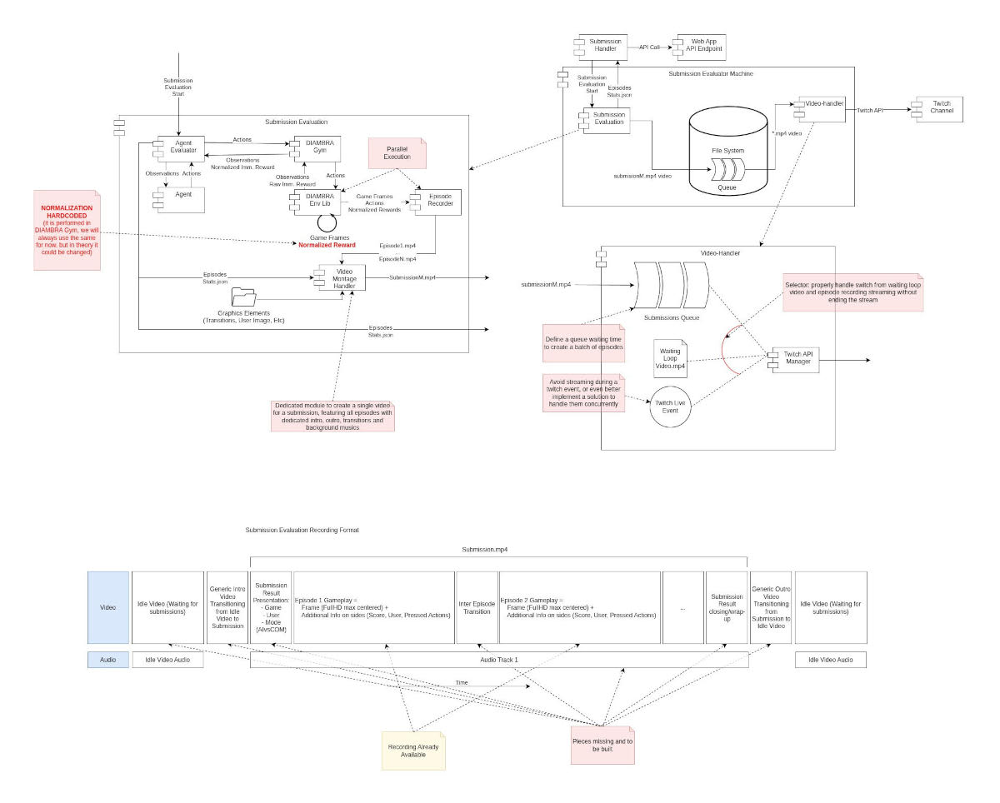

**TL;DR**: *Over four years, I built DIAMBRA, an open platform for training, submitting, and evaluating DeepRL agents in arcade-style environments. It blends custom Gym-compatible environments with training pipelines, tournament infrastructure, and real-time evaluation, making it possible to experiment with single- and multi-agent RL, imitation learning, offline training, and even more advanced techniques like league training. Beyond the tech, it’s a space where you can learn by building, and actually enjoy the process of developing agents, because competing in a video game tournament with your own AI never really gets old.*

[Show me the code](#references)

-------------------------------------

DIAMBRA is a platform I built over four years to explore what happens when you bring Deep Reinforcement Learning into a competitive, community-driven setting. The idea was simple but ambitious: let people train agents in high-quality arcade-style environments and submit them to real tournaments, complete with leaderboards, Twitch-streamed matches, and unlockable achievements.

Under the hood, DIAMBRA became a surprisingly deep technical project, covering everything from Gym-compatible environment design to evaluation infrastructure and agent orchestration. I wrote most of it hands-on, blending research tools with production-grade systems to make something both useful and fun to interact with.

For me, it was a chance to get deeply involved in everything I love: RL, simulation, software architecture, and building things that people actually use.

In December 2024, DIAMBRA was acquired, marking a meaningful endpoint to a long, hands-on journey, and a testament to the value of deeply technical, open, and community-driven work in the Reinforcement Learning space.



### Motivation

Back in 2020, the most exciting breakthroughs in AI were happening in Deep Reinforcement Learning. Projects like AlphaGo and OpenAI Five weren’t just research milestones, they were public, high-stakes competitions that showed what intelligent agents could really do. As someone already fascinated by RL, I couldn’t stop thinking about how these agents learned to make decisions, adapt, and outperform humans in such complex games.

While co-authoring [The Reinforcement Learning Workshop for Packt](/papers/rlworkshop), I got to spend a lot of time digging into the tools available for experimenting with RL. That’s when the gap really hit me: most open environments fell into two extremes, either too simple and academic (like Atari via ALE) or so complex that they were impractical to run on a single machine (like StarCraft II or Dota). There was almost nothing in between.

That’s where the idea started. I wanted to create environments that were:
 - **Engaging** and fun to interact with, like the fighting games I grew up with
 - **Lightweight** enough to train on a personal workstation
 - **Rich** enough to support a variety of RL paradigms: from classic PPO/DQN to multi-agent, imitation learning, or human-in-the-loop setups

Once the environments came together, the next step felt natural: what if we could make the agents fight each other? Not just offline evaluation, but actual live tournaments, head-to-head matches, rankings, streamed replays. I wanted coders to feel that same competitive thrill you get in esports, robotics battles, or Kaggle challenges, except this time, their agents would be in the arena.

That was the spark that became DIAMBRA.

  
  
<em>Available Titles</em>

### Project Scope & My Role

My role in DIAMBRA covered the full AI/ML stack, from low-level environment design to community-facing tooling. I took care of everything that touched Reinforcement Learning: building the environments from scratch, standardizing interfaces, integrating training libraries, designing the evaluation logic for head-to-head matches, and even running community tournaments with real-time streams on Twitch and YouTube.

This meant writing C++ code for performant emulation, building Python bindings over gRPC, setting up Docker pipelines for cross-platform deployment, writing documentation, maintaining repos, engaging with users, and constantly refining how the platform could serve both researchers and hobbyists. What started as a solo effort eventually grew into a proper ecosystem, with contributors, users, tournaments, and a clear identity in the RL landscape.

Here below are the three core areas I focused on.

#### Arcade RL Environments

  
  
<em>Agent-Environment Interaction Loop</em>

At the heart of DIAMBRA was a suite of high-quality arcade-style environments built to balance realism, playability, and research flexibility. I designed them with the goal of being fun to work with, but also rich enough to support serious experimentation.

- All environments followed the **Gymnasium API standard**, making them instantly compatible with mainstream RL libraries.
- Observations included both **raw pixel frames** and **structured numerical state data**, which enabled hybrid models and richer architectures.
- Under the hood, environments were written in **C++ for speed**, exposed to Python via **gRPC**, and **fully Dockerized** to ensure reproducibility and smooth deployment.
- I implemented **native support for Stable Baselines 3 and Ray RLlib**, while keeping things flexible enough for custom training pipelines.
- Each environment supported multiple modalities:
  - **Single-agent** tasks (AI vs CPU)
  - **Multi-agent adversarial** setups (AI vs AI, including self-play)
  - **Human-agent interaction**
  - **Imitation learning scenarios**

I also worked on portability across platforms, supporting Linux, Windows, and MacOS, and packaged everything for simple installation via `pip`. This made DIAMBRA Arena one of the few plug-and-play RL environments that felt polished, high-performance, and research-friendly.

  
  
<em>Observation and Action Space</em>

#### Training Agents

To make experimentation fast and reproducible, I built **starter kits** and full training pipelines in the [DIAMBRA Agents](https://github.com/diambra/agents) repo.

These covered popular training algorithms like PPO, with modular support for plugging in custom networks or reward shaping strategies. The environments were designed with just enough structure to make RL tractable on consumer hardware, without sacrificing the challenge.

  
  
<em>Training Architecture</em>

We also showed that [DIAMBRA could scale to more advanced training setups, including league training strategies](https://github.com/alexpalms/DIAMBRA-Arena-MARL-TLeague) (multi-agent population-based curriculum), which are typically used in competitive or self-play scenarios.

  
  
<em>League Training</em>

The idea was to give users a launchpad: whether you were experimenting with a new algorithm, fine-tuning reward signals, or testing generalization strategies, DIAMBRA’s training stack made it easy to get started and iterate quickly.

Here are a couple of videos showing agents at different training stages.



  
<em>Dead Or Alive ++</em>



  
<em>Tekken Tag Tournament</em>

#### Evaluation & Tournament Infrastructure

Once you’ve trained your agent, what’s next? In DIAMBRA, you could submit it to the **public platform**, where it would be evaluated in head-to-head matches, either against the built-in CPU opponent (AI vs COM) or other users’ agents (AI vs AI).

Behind the scenes, I built an agent orchestration system that handled:
 - **Episode scheduling and rollout** for 1v1 matches
 - **Evaluation metric tracking** (win rates, performance scores, behaviors)
 - **Leaderboard computation** across games and users
 - **Achievement unlocking** based on specific milestones (e.g., winning a round without taking damage)

All episodes were **recorded and streamed automatically** on Twitch, turning agent performance into something visible and shareable. This added a layer of excitement and transparency to the process, users could *watch* their agents compete, win, lose, or evolve over time.

  
  
<em>Not the most trivial side-project. And this is just the evaluator piece...</em>

This system not only made RL evaluation more engaging, but also allowed for **benchmarking** and **reproducibility**, two things often missing in casual RL experimentation.

### Reflections

Looking back, what I gained the most from DIAMBRA wasn’t just experience, it was depth. There’s something about building a full system from scratch that forces you to really learn a topic. You hit every corner case, every design tradeoff, every weird bug that only shows up after 10,000 episodes. You don’t just understand the theory, you live it.



  
<em>Reward Engineering</em>

That process took me deep into areas of RL that you usually only skim in tutorials: observation preprocessing, action space design, environment determinism, reproducibility, reward hacking, evaluation pipelines, agent orchestration, and more. I had to really solve these problems, and in doing so, I developed a much stronger, more intuitive grasp of what actually makes RL work (or break).



  
<em>Reward Hacking</em>

But if I had to name the single best thing about the project, it’s the **pure range of experimentation it unlocks**. With DIAMBRA, you can:
 - Train agents using online, offline, or imitation learning
 - Explore multi-agent setups, self-play, or human-agent interaction
 - Play with reward shaping, and discover how easily it leads to reward hacking
 - Even try out unconventional things like applying neural style transfer to tweak visual observations



  
<em>Neural Style Transfer</em>

And all of this happens in a setting that’s genuinely fun to use. There’s something really satisfying about seeing your PPO agent finally beat a CPU opponent in a game you used to play as a kid. It brings a bit of play back into research, and that’s something I’ve come to really value.

### References

- 👨🏽‍💻 GitHub:
  - Project page: https://github.com/diambra/
  - Environment: https://github.com/diambra/arena
  - Agent training examples: https://github.com/diambra/agents
  - League training: https://github.com/alexpalms/DIAMBRA-Arena-MARL-TLeague
  - Neural painter: https://github.com/alexpalms/diambra-game-painter
- 🎓 Paper: https://arxiv.org/abs/2210.10595
- 📚 Docs: https://docs.diambra.ai/