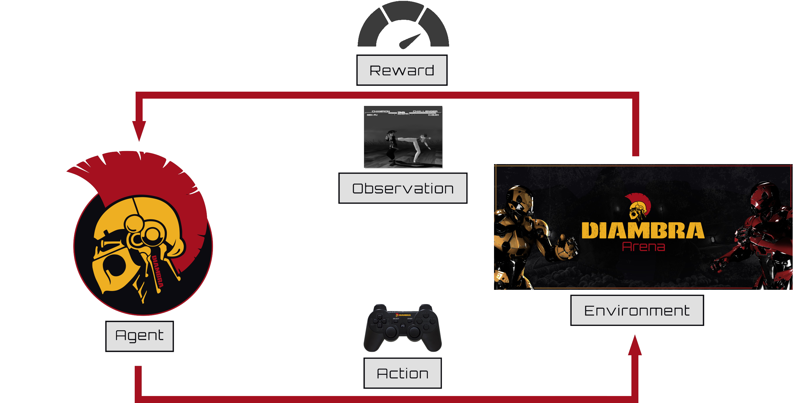
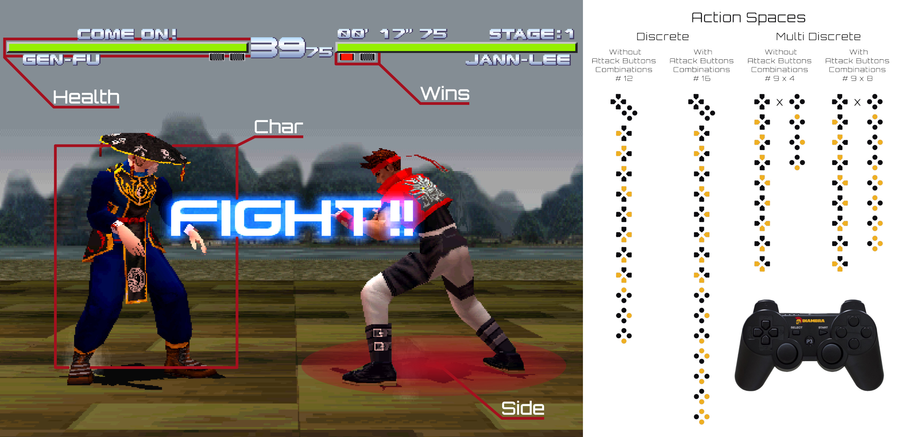
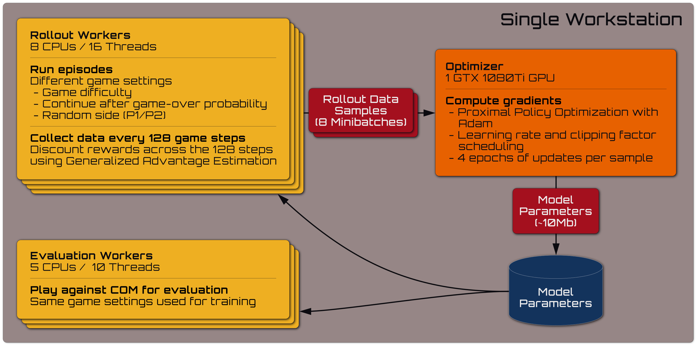

DIAMBRA is a platform I built over four years to explore what happens when you bring Deep Reinforcement Learning into a competitive, community-driven setting. The idea was simple but ambitious: let people train agents in high-quality arcade-style environments and submit them to real tournaments, complete with leaderboards, Twitch-streamed matches, and unlockable achievements.

Under the hood, DIAMBRA became a surprisingly deep technical project, covering everything from Gym-compatible environment design to evaluation infrastructure and agent orchestration. I wrote most of it hands-on, blending research tools with production-grade systems to make something both useful and fun to interact with.

For me, it was a chance to get deeply involved in everything I love: RL, simulation, software architecture, and building things that people actually use.



### Motivation

Back in 2020, the most exciting breakthroughs in AI were happening in Deep Reinforcement Learning. Projects like AlphaGo and OpenAI Five weren’t just research milestones, they were public, high-stakes competitions that showed what intelligent agents could really do. As someone already fascinated by RL, I couldn’t stop thinking about how these agents learned to make decisions, adapt, and outperform humans in such complex games.

While co-authoring [The Reinforcement Learning Workshop for Packt](/papers/rlworkshop), I got to spend a lot of time digging into the tools available for experimenting with RL. That’s when the gap really hit me: most open environments fell into two extremes, either too simple and academic (like Atari via ALE) or so complex that they were impractical to run on a single machine (like StarCraft II or Dota). There was almost nothing in between.

That’s where the idea started. I wanted to create environments that were:
 - **Engaging** and fun to interact with, like the fighting games I grew up with
 - **Lightweight** enough to train on a personal workstation
 - **Rich** enough to support a variety of RL paradigms: from classic PPO/DQN to multi-agent, imitation learning, or human-in-the-loop setups

Once the environments came together, the next step felt natural: what if we could make the agents fight each other? Not just offline evaluation, but actual live tournaments, head-to-head matches, rankings, streamed replays. I wanted coders to feel that same competitive thrill you get in esports, robotics battles, or Kaggle challenges, except this time, their agents would be in the arena.

That was the spark that became DIAMBRA.

  
  
<em>Available Titles</em>

### Project Scope & My Role

Use this to make clear that you weren’t just managing—you were hands-on. Describe what you actually built.

Bullet-style or paragraph:

Led architecture and implementation of the full platform (backend, leaderboard, evaluation infrastructure, Twitch streaming integration)

Developed the DIAMBRA Arena environment package, providing a Python Gym-compatible API for RL research

Integrated native support for Stable Baselines 3, Ray RLlib, and custom training frameworks

Designed environments supporting multiple modes: standard RL, self-play, human-agent, and imitation learning

Worked on deployment across major OSes (Linux, Windows, MacOS) with simple pip-based install flow

### DIAMBRA Arena: Arcade-Style RL Environments
Here, highlight:

Episodic tasks with image + numeric observations

Single- and two-player environments

Discrete action spaces

Multi-agent scenarios, competitive agents, and support for self-play

  
  
<em>Agent-Environment Interaction Loop</em>

  
  
<em>Observation and Action Space</em>

### Training Agents

Explain how users trained agents:

With SB3 or RLlib

With your provided starter kits: diambra/agents

Use of PPO/DQN-style agents

League training or human-in-the-loop workflows (if supported)

  
  
<em>Training Architecture</em>





### Evaluation & Tournament Infrastructure

Describe the global leaderboard concept

Explain how agents were submitted, evaluated, and ranked

Mention the Twitch integration and visual streaming of matches

Talk about fairness, reproducibility, and benchmarking

### Technical Highlights

Here you can list or briefly explain:

Cross-platform support

Standardization (Gym API, SB3/RLlib integration)

Reusability of environments for multiple RL paradigms (online, offline, imitation)

Reproducibility features: seeding, repeatable episodes, etc.







### Reflections

### References

- 👨🏽‍💻 GitHub:
  - Project page: https://github.com/diambra/
  - Environment: https://github.com/diambra/arena
  - Agent training examples: https://github.com/diambra/agents
- 🎓 Paper: https://arxiv.org/abs/2210.10595
- 📚 Docs: https://docs.diambra.ai/