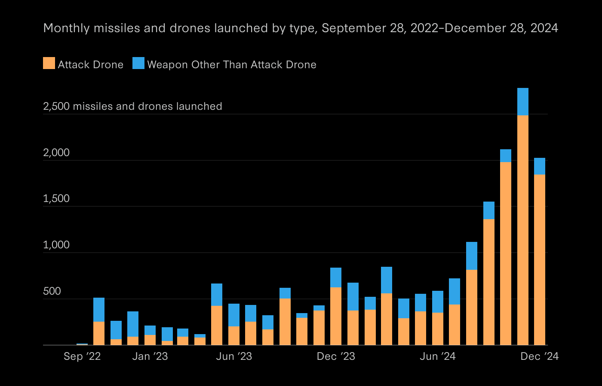
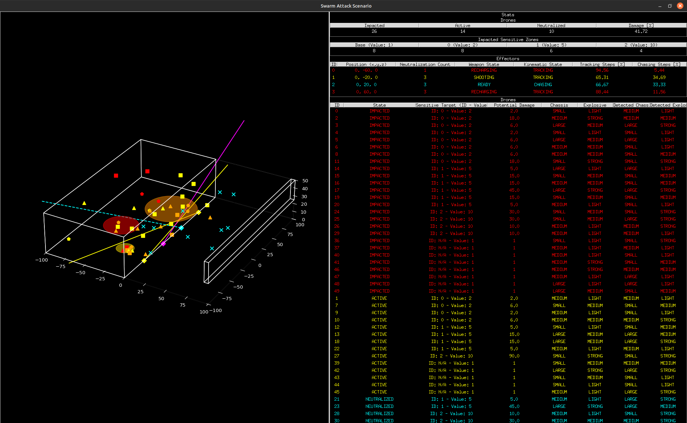
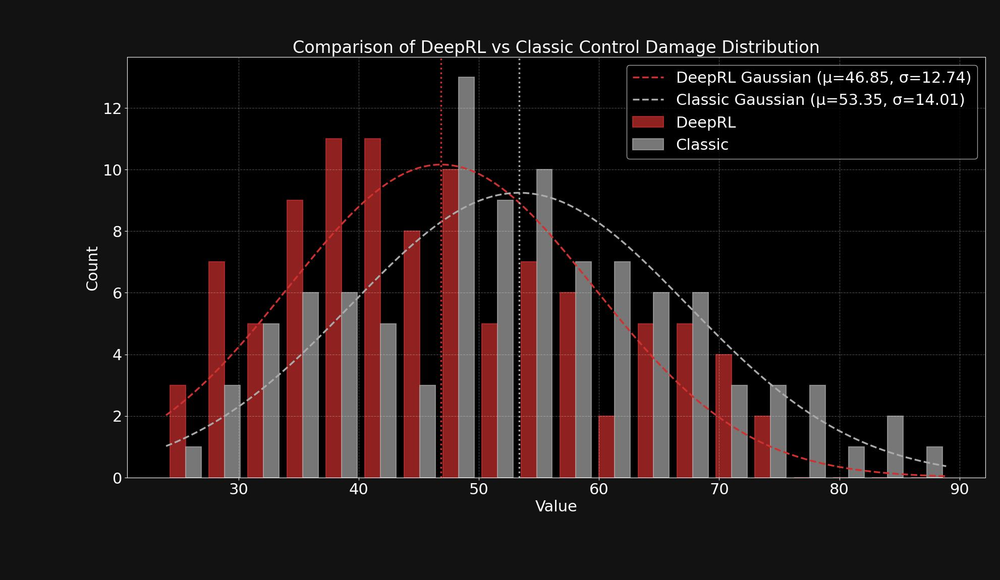
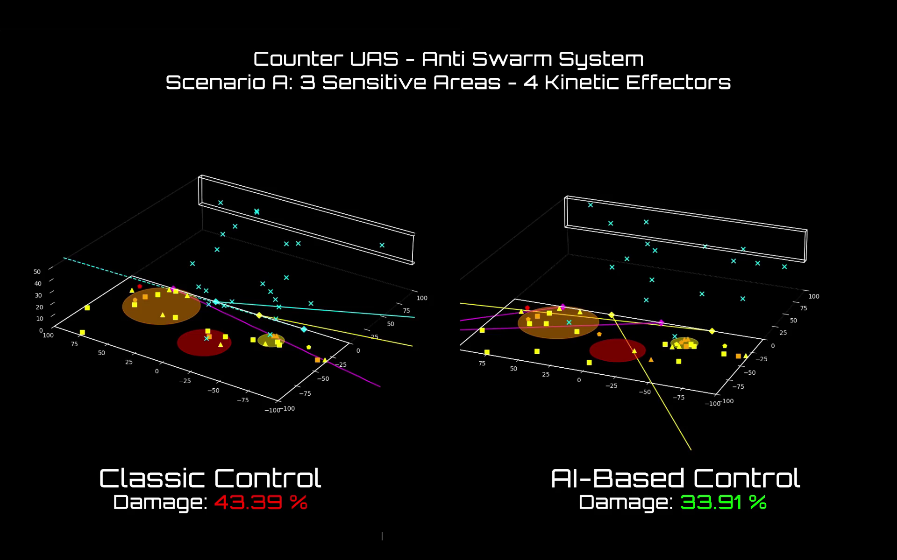

### Motivation

The rise of low-cost, autonomous drone swarms has transformed the threat landscape, what used to be science fiction is now a tactical reality. Swarms composed of dozens (or even hundreds) of kamikaze UAVs can overwhelm traditional air defense systems through sheer volume, speed, and unpredictability.

Conventional rule-based or reactive systems often struggle in this context. They lack the ability to prioritize threats intelligently, coordinate actions across multiple effectors, or adapt to scenarios with noisy or incomplete information. As the problem space grows more complex, with heterogeneous drone behaviors, uncertain trajectories, and probabilistic engagement outcomes, these limitations become critical.

That’s where Reinforcement Learning comes in. Unlike hand-coded strategies, RL allows policies to emerge organically through experience. It can handle uncertainty, adapt to new swarm patterns, and balance multiple objectives, like minimizing damage, conserving resources, and avoiding overkill. More importantly, it offers the opportunity to learn behaviors that would be hard, or even impossible, to design manually.

In this project, I wanted to explore whether a trained RL agent could learn to coordinate multiple kinetic effectors to defend a fixed zone from a large-scale kamikaze drone attack. The agent operates under partial observability, receives noisy positional data, and must make real-time decisions to intercept threats before they reach the target.

The result is a fully custom, simulation-based control problem that closely mirrors the kind of decision-making challenges faced in real-world defense systems, complex, fast-moving, and high-stakes. Not only did the RL-trained model learn to navigate this space effectively, but it also significantly outperformed classical control solutions, demonstrating superior threat prioritization, coordination, and overall reduction in target zone damage.

<div style="text-align: center;">
  
  <p><em>Increase in Drones Attack in Recent Conflicts</em></p>
</div>

###  Problem Framing & System Design

At a high level, the challenge involves a number of kinetic effectors tasked with defending a set of sensitive zones against incoming kamikaze drones. These drones vary in size, explosive yield, and flight path, and are deployed in large, randomized swarms with the goal of overwhelming the defense system.

Each episode simulates a coordinated attack: dozens of drones approach one or more target zones following random (but continuous and goal-directed) trajectories. The agent receives partial and noisy observations of the environment, simulated detections include drone positions with Gaussian noise, and imperfect estimates of size and explosive type. Despite this uncertainty, the agent must coordinate its effectors to minimize total damage, making fast and effective firing decisions in real time.

This control problem blends stochastic dynamics, high-dimensional state spaces, and asymmetric cost structures, making it both a practical and research-grade RL testbed. Below, I describe how the simulation environment and RL system were built.

#### Simulation Environment

The environment was built from scratch to capture the complexity and realism of modern drone defense scenarios. The key components include:
- **Kinetic Effectors**: Each effector can rotate in azimuth and elevation, with bounded angular velocity. After each shot, a recharging delay is enforced. Hits are probabilistic, **neutralization probability** is modeled as a function of the miss distance between the shot and the *real* drone position.
- **Sensitive Zones**: Fixed within the scenario and assigned different **strategic values**, meaning that damage is weighted differently depending on which zone is hit. This encourages the agent to **prioritize threats**, not just maximize shot counts.
- **Drones**: Each drone is sampled from a custom distribution of **sizes and explosive types**, affecting its flight profile and potential impact. Trajectories are randomized per episode, with fixed start and end goals but variable motion paths.
- **Observations**: The agent receives a vector per drone with:
  - Noisy 3D position
  - Noisy estimate of size
  - Noisy estimate of explosive type
- **Actions**: For each effector, the agent selects which **drone to target** (if any) at every timestep. The rest, rotations, delays, and miss distance evaluation, is handled by the simulation.
- **Reward Function**: The episode return is based on **total zone damage**, computed as a function of the drone's explosive yield and the zone's strategic value. The agent is implicitly incentivized to minimize this sum.
- **Scenario Variability**: While zone and effector positions are fixed per scenario, each episode features a randomized drone swarm, with variable initial positions, destinations, and flight dynamics, creating a **rich distribution of challenges** to learn from.

<div style="text-align: center;">
  
  <p><em>Simulation Visualization</em></p>
</div>

#### Reinforcement Learning

The control policy was trained using **Proximal Policy Optimization (PPO)**, chosen for its robustness in handling environments with high-dimensional, partially observable state spaces and delayed rewards.

The setup consisted of a **centralized policy model** that controlled all effectors jointly. At each timestep, the policy receives the full observation vector (structured across all active drones) and outputs a **discrete action** for each effector, specifying which drone (if any) to target. This enables joint decision-making across effectors while keeping the interface clean and interpretable.

- **Observation Preprocessing**: Before feeding observations into the network, raw drone data was normalized per feature (position, size, explosive type) and structured into a fixed-size input, padded as needed. This helped the model generalize across swarm sizes and drone configurations.
- **Policy Architecture**: The policy was a simple but effective **multi-layer perceptron (MLP)** processing the full input and jointly outputting one discrete action per effector. The network learned to implicitly coordinate effectors, allocating targets to avoid redundancy and prioritize high-threat drones.
- **Reward Normalization**: Since total episode damage could vary widely depending on the incoming swarm, **reward normalization** was applied across the training buffer. This improved gradient stability and accelerated convergence during early training.

This setup allowed the agent to evolve beyond reflex-based responses, learning to **balance firing cadence, coordinate targeting, and even hold fire** when interception was unlikely, leading to strategic behavior that clearly outperformed hand-coded baselines.

### Training & Evaluation

Training the RL agent wasn’t just about running PPO out of the box, it required thoughtful tuning and iteration to reach robust, generalizable performance. I conducted a **hyperparameter search** exploring several key factors:

- **Network architecture**: Number of hidden layers and neurons per layer
- **Learning rate and scheduling** (linear decay vs constant)
- **Discount factor** and **clipping range**
- **Number of parallel environments** used for experience collection

The goal was to balance **sample efficiency** and **policy stability**, while avoiding premature convergence to suboptimal reactive behaviors (e.g., always targeting the closest drone). Periodic **checkpoint-based evaluations** were used during training to assess how well the agent was generalizing beyond its training buffer.

```less
[Input Obs]
     |
[Flatten drones_zones_distance]
     |
[Linear 150→64 + ReLU]
     |-------------------------------|
     |                               |
[pi_policy_net]                  [vf_value_net]
 (Linear 64→64 + ReLU)           (Linear 64→64 + ReLU)
     |                               |
[action_net: Linear 64→200]      [value_net: Linear 64→1]

```
<div style="text-align: center;">
  <p><em>Neural Network Architecture</em></p>
</div>


To properly benchmark performance, I ran a full evaluation comparing three policies across a large number of randomized swarm scenarios:

- **Random agent**: Selects targets uniformly at random for each effector.
- **Classic control policy**: Implements a hand-crafted heuristic prioritizing drones based on their **distance to sensitive zones**, weighted by **zone value** and **estimated drone explosive power**. It includes a distribution heuristic to avoid over-targeting the same drone.
- **Deep RL agent**: The PPO-trained model described above.

Each agent was evaluated across **hundreds of randomized episodes**, measuring the **total damage inflicted to sensitive zones** as the main metric. I tracked both **average damage** and **standard deviation** to assess not only performance but also **stability under diverse conditions**.

### Results

The results consistently demonstrate the effectiveness of the Deep RL approach.

**Statistical Performance Overview.** A high-volume batch of randomized simulation episodes (same scenario setup, varied drone trajectories) was used to benchmark both the classic and the learned policy.
The distribution of total suffered damage across these episodes reveals a significant advantage for the RL controller. Gaussian fits over the episode outcomes show a clear shift: the RL agent results in an average damage of 46%, compared to 53% for the classic heuristic, a meaningful reduction given the critical nature of the defense task.

<div style="text-align: center;">
  
  <p><em>DeepRL vs Classic Controller - Damage Comparison</em></p>
</div>

**Behavioral Comparison - Side-by-Side Simulation.** To illustrate the behavioral difference more tangibly, we provide a video comparison where both controllers are subjected to the exact same drone swarm configuration, thanks to controlled simulation seeding.
The classic policy follows a fixed logic based on proximity and estimated threat, while the RL policy exhibits more nuanced, adaptive target selection and coordination, leading to better prioritization and interception.



<div style="text-align: center;">
  <p><em>DeepRL vs Classic Controller - Full Episode Performance Comparison</em></p>
</div>

**Final State Snapshot.** A side-by-side image of the simulation's end state clearly shows the impact: while both policies allow some damage, the RL agent more effectively protects the highest-value sensitive zones, redirecting threats or neutralizing them early. The classic controller fails to make such distinctions, resulting in suboptimal damage distribution.

<div style="text-align: center;">
  
  <p><em>DeepRL vs Classic Controller - Final Simulation Step Comparison</em></p>
</div>

Together, these results validate the use of reinforcement learning not just as a viable solution, but as a superior one, in orchestrating complex, reactive defense systems under uncertainty.

### Reflections

This project highlights the significant potential of **Reinforcement Learning as a control paradigm** in defense scenarios that are fast-paced, uncertain, and too complex for traditional rule-based systems to handle effectively. When tasked with prioritizing threats in a dynamic multi-agent swarm setting, the learned policy consistently outperformed handcrafted logic, not by exploiting low-level dynamics, but by developing adaptive, emergent behaviors from the data and objectives we provided.

Importantly, the RL agent here does **not directly control actuators** or make irreversible decisions. Its role is intentionally abstracted: to **prioritize threats** based on noisy, probabilistic data and mission-critical tradeoffs. This higher-level positioning allows the system to act **as an intelligent recommender**, rather than a fully autonomous agent, an important distinction when deploying AI in safety-critical contexts.

Moreover, this structure opens the door for **Human-in-the-Loop operation**. The RL policy’s prioritization scores can be surfaced to human operators as an additional signal, essentially a real-time estimate of "threat level" derived from complex, learned dynamics. This transforms the AI from a black-box decision-maker into a powerful **decision support system**, augmenting situational awareness and assisting, rather than replacing, operator judgment.

This experiment not only demonstrated strong performance gains, but also a viable path to safely and meaningfully **integrate RL into real-world defense architectures**, where adaptability, interpretability, and collaboration with human operators are paramount.

### References

- 👨🏽‍💻 GitHub Code: https://github.com/diambra/
