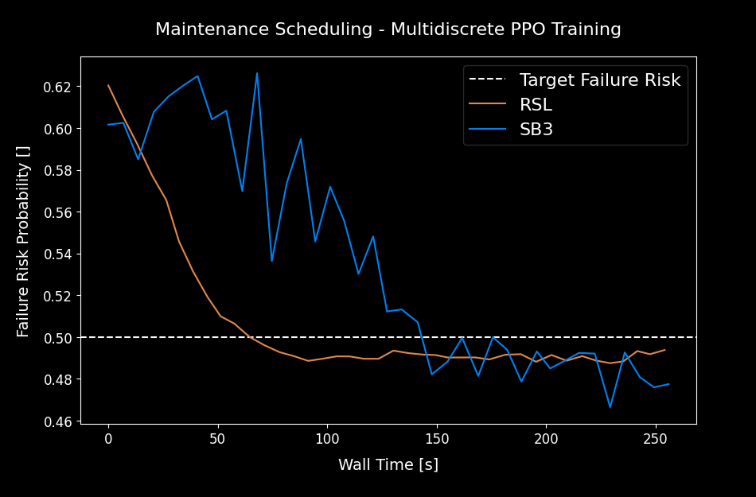
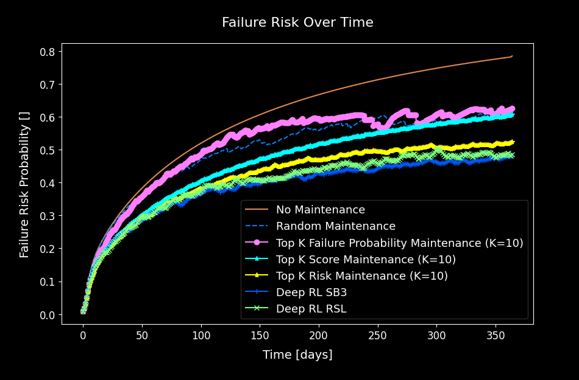
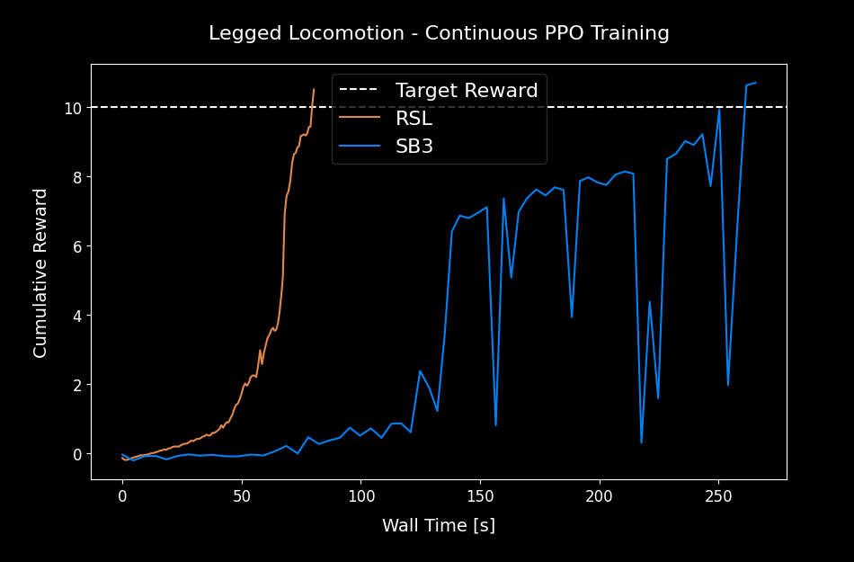
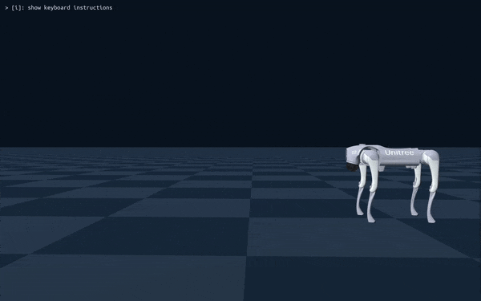
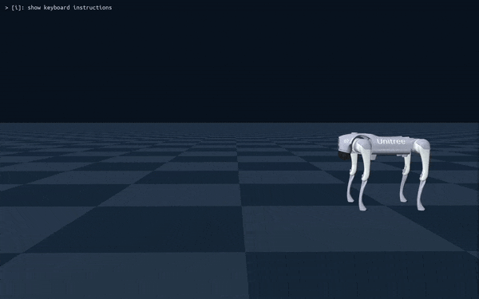

  

**TL;DR**: *I extended the RSL-RL library to support **multi-discrete action spaces** while keeping continuous control fully intact. Benchmarks show RSL-RL matches Stable Baselines 3 in performance on both tasks and **runs faster thanks to full GPU execution**. This makes RSL-RL a versatile, high-speed option for robotics, scheduling, and other decision-making problems.*

### Introduction

RSL-RL is a compact, GPU-native reinforcement learning library from the legged robotics community that prioritizes speed and simplicity. Its design, clean PPO implementation, minimal boilerplate, and an end-to-end GPU pipeline, makes it a great fit for high-throughput continuous-control tasks like robotic locomotion.

However, many real-world decision problems aren’t purely continuous. Scheduling, routing, and structured control often require multi-discrete action spaces (e.g., choose one option in each of several independent branches). Out of the box, RSL-RL only supported continuous actions, which limited its applicability beyond typical robotics control.

My goal in this project was straightforward: add first-class support for multi-discrete actions while preserving everything that makes RSL-RL appealing, its GPU-first speed and its clean developer experience. Concretely, I wanted to:

- Extend the actor-critic and rollout storage to handle multi-discrete distributions without breaking existing continuous workloads.
- Keep the API changes minimal and intuitive.
- Validate the implementation on both fronts: a continuous robotics benchmark and a multi-discrete optimization task, checking for performance parity with Stable Baselines 3 and ensuring no regressions in continuous control.

###  Why Multi-Discrete Action Spaces Matter

In reinforcement learning, action spaces define the kind of decisions an agent can make. While continuous actions (like joint torques in robotics) and single-discrete actions (like moving left or right in a game) cover many cases, they aren’t always enough.

A multi-discrete action space is essentially a set of independent categorical choices made at the same time. Instead of choosing just one action, the agent selects one option per branch.

For example:
 - Maintenance scheduling: for each machine, decide whether to service it this cycle or not.
 - Resource allocation: distribute different resource types (CPU, bandwidth, storage) across competing tasks.

These problems don’t map cleanly to a continuous action space, multi-discrete actions are the natural fit.

By adding this capability, RSL-RL is no longer confined to robotics-style continuous control. It can now be applied to optimization problems, scheduling tasks, and decision-making domains that were previously better handled by other libraries like Stable Baselines 3. And because RSL-RL runs entirely on GPU, it can bring significant speedups in wall-clock training time to these new problem classes.

### Implementation Details

The core of this project was extending the RSL-RL codebase to natively support multi-discrete actions while keeping continuous control fully functional. You can see all the modifications in my [commit here](https://github.com/alexpalms/discrete_rsl_rl/commit/d9ccebe7fee536b574ea36dfd94c0f4ccde8c916?diff=split).

Here’s a high-level overview of the changes:

- **Actor-Critic Module.** The `ActorCritic` class was refactored to handle both continuous and multi-discrete distributions. For continuous actions, it still outputs mean and standard deviation vectors. For multi-discrete actions, it now outputs concatenated logits per branch and manages sampling, evaluation, and log-probability calculations appropriately. This allows PPO and other algorithms to work seamlessly with either action type.

- **Rollout Storage.** Rollout storage was adapted to store logits for multi-discrete actions instead of continuous action vectors. This includes modifications to `add_transitions` and mini-batch generators to maintain a uniform interface for both types of action spaces. The storage still resides fully on GPU for maximum speed.

- **PPO Runner.** The on-policy runner was updated to correctly initialize the algorithm with the proper shapes for multi-discrete actions. It now dynamically handles action type selection from the environment configuration without breaking the continuous action workflow.

Key Points:
- The implementation maintains **full GPU execution**, no matter if actions are continuous or multi-discrete.
- Continuous action benchmarks remain **unaffected**, ensuring no regressions.
- The API changes are minimal, keeping the library intuitive and easy to use.

These updates make RSL-RL more versatile, opening the door to a broader class of reinforcement learning problems without sacrificing speed or simplicity.

### Testing Setup

To validate the new multi-discrete support and ensure no regressions on continuous tasks, I set up two benchmarks:

#### Multi-Discrete Control: Maintenance Scheduling Optimization
 - **Environment**: Custom maintenance scheduling optimization problem, where the agent decides which machine to service at each timestep, for 1 year simulation.
 - **Action Space**: Multi-discrete machine choice.
 - **Goal**: Test the correctness and efficiency of multi-discrete support in RSL-RL.
 - **Validation**: Compared performance and training curves with SB3’s multi-discrete PPO implementation.

#### Continuous Control: Unitree Go2 Locomotion
 - **Environment**: Genesis simulator with a Unitree Go2 quadruped robot.
 - **Action Space**: Fully continuous robot controls.
 - **Goal**: Evaluate if the modified RSL-RL still matches or exceeds baseline performance in standard continuous locomotion tasks.
 - **Validation**: Compared training curves with original RSL-RL library results and evaluation runs with Stable Baselines 3 (SB3) using PPO.

Both benchmarks were run **fully on GPU**, ensuring that the new multi-discrete implementation leveraged RSL-RL’s GPU-first design.

This dual setup allows for **direct comparison**: checking that continuous control remains stable while assessing the effectiveness of the new multi-discrete capabilities.

### Results

The updated RSL-RL library was benchmarked on both multi-discrete and continuous tasks. Here’s what we observed:

#### Multi-Discrete Control

  
  
<em>Multi-discrete action space training curves comparison, RSL vs SB3.</em>

**Training Curves**: RSL-RL converges at a similar pace and final performance as Stable Baselines 3 (SB3) on the maintenance scheduling task.

**Evaluation**: The agent reliably generates high-quality schedules, satisfying constraints and optimizing the objective.

  
  
<em>Optimal maintenance scheduling for failure risk minimization.</em>

**Key Takeaway**: RSL-RL now handles multi-discrete actions effectively, achieving parity with SB3 in solution quality while maintaining GPU execution.

#### Continuous Control

  
  
<em>Continuous action space training curves comparison, RSL vs SB3.</em>

**Learning Curves**: RSL-RL continues to match SB3’s performance on the Unitree Go2 locomotion benchmark.

**Evaluation**: Videos and GIFs of the robot show stable and natural walking gaits, with no observable regressions from the original RSL-RL implementation.

<table>
  <tr>
    <td width="50%"></td>
    <td width="50%"></td>
  </tr>
  <tr>
    <td align="center">Trained Model Evaluation - RSL</td>
    <td align="center">Trained Model Evaluation - SB3</td>
  </tr>
</table>

**Key Takeaway**: The multi-discrete modifications do not compromise continuous control, preserving the library’s original capabilities.

#### Speed

**Wall-Time Comparison**: Across both tasks, RSL-RL exhibits faster convergence in terms of wall-clock time due to its fully GPU-native implementation.

**Impact**: Users can experiment with both continuous and multi-discrete tasks significantly faster than other solutions like SB3, making this extension a valid and practical alternative for high-throughput RL research and rapid prototyping.

The results confirm that RSL-RL is now a flexible and high-performance platform capable of tackling a broader range of RL problems without sacrificing speed or reliability.

### References

- 👨🏽‍💻 GitHub Code: https://github.com/alexpalms/discrete_rsl_rl
